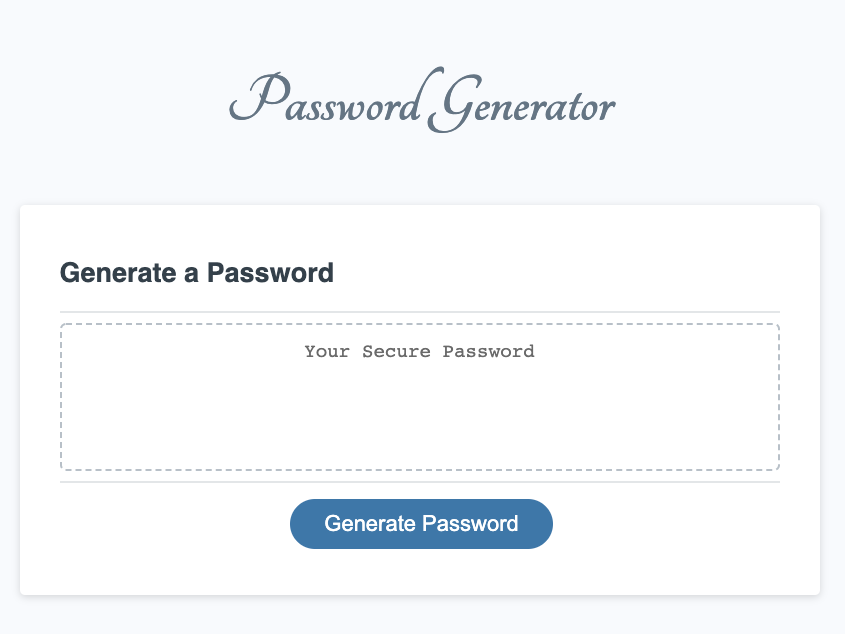

# Password_Generator
Create an application that generates a random password based on user-selected criteria. This app will run in the browser and feature dynamically updated HTML and CSS powered by your JavaScript code. It will also feature a clean and polished user interface and be responsive, ensuring that it adapts to multiple screen sizes.

>Link : https://jiji-smith.github.io/3_Password_Generator/

## User Story
AS AN employee with access to sensitive data
I WANT to randomly generate a password that meets certain criteria
SO THAT I can create a strong password that provides greater security
## Acceptance Criteria
GIVEN I need a new, secure password  
WHEN I click the button to generate a password   
THEN I am presented with a series of prompts for password criteria   
WHEN prompted for password criteria   
THEN I select which criteria to include in the password   
WHEN prompted for the length of the password   
THEN I choose a length of at least 8 characters and no more than 128 characters   
WHEN prompted for character types to include in the password   
THEN I choose lowercase, uppercase, numeric, and/or special characters   
WHEN I answer each prompt   
THEN my input should be validated and at least one character type should be selected   
WHEN all prompts are answered   
THEN a password is generated that matches the selected criteria   
WHEN the password is generated   
THEN the password is either displayed in an alert or written to the page

## How to use the password generator
<ol>
<li>Click the Generate Passwords button</li>
<li>Input the desire length of the passwords (8-128 digits)</li>
<li>Choose the types of characters (Lowercase, Uppercase, Special Character, Numbers)</li>
<li>If everything fits in the condition, it will generate the passwords for you!</li>
</ol>

